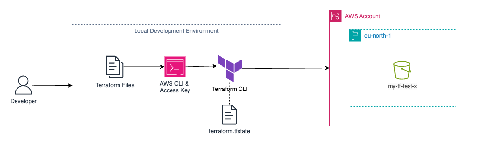

# AWS Infrastructure Setup with Terraform for Local Development

This guide walks you through setting up basic AWS infrastructure using Terraform for local development. You'll learn how to provision an AWS S3 bucket as a demonstration of Terraform's infrastructure-as-code capabilities.


## Prerequisites

* [Terraform](https://developer.hashicorp.com/terraform/downloads)
* [AWS CLI](https://aws.amazon.com/cli/) configured (`aws configure`)
* Access Key under root account

## 1. Configure AWS Credentials
Set up your AWS credentials as environment variables to avoid hardcoding sensitive information:
```bash
export AWS_ACCESS_KEY_ID=""
export AWS_SECRET_ACCESS_KEY=""
```
For more secure credential management: https://registry.terraform.io/providers/hashicorp/aws/latest/docs

## 2. Project Structure
Organize your infrastructure code for clarity and scalability:
```
mlops-course-01/
├── assets/
├── docs/
├── src/
├── terraform/
│   ├── provider.tf
│   └── s3.tf
└── README.md
```
All Terraform files live under the `terraform/` folder.

## 3. Terraform Configuration
Specifies AWS as provider, enforces version, and sets the region.

`provider.tf`
```hcl
terraform {
  required_providers {
    aws = {
      source  = "hashicorp/aws"
      version = ">=5.97"
    }
  }
}

provider "aws" {
  region = "eu-west-1"
}
```
Creates an S3 bucket with a unique name.

`s3.tf`
```hcl
resource "aws_s3_bucket" "example" {
  bucket = "my-tf-test-d9237282392372dsdsd8"
}
```

### 4. Apply Terraform Configuration using Terraform CLI
```bash
terraform init                # Download providers and initialize the project
terraform validate            # Check configuration for errors
terraform fmt --recursive     # Format files for readability
terraform plan                # Preview what will be created
terraform apply               # Create the resources
terraform destroy             # Remove all managed resources
```
